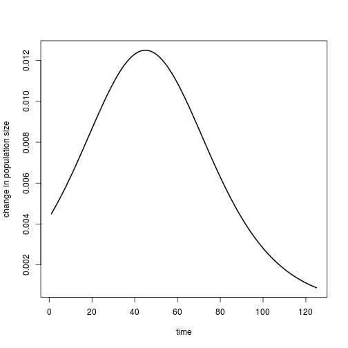
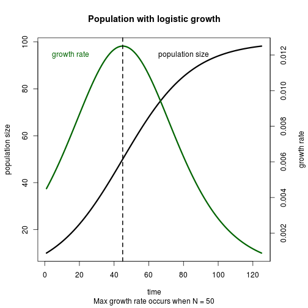

### Mini exercise 3.2.1

Tweaking parameters of discrete growth model


```r
# conditions & parameters (these are new!)
generations <- 100
RR <- 0.9 # R is a parameter
N_init <- 100 # N is a state variable

# create and populate pop size vector
pop_sizes <- numeric(generations)
pop_sizes[1] <- N_init
for (time in 2:generations){
  pop_sizes[time] <- RR*pop_sizes[time-1]
}

head(pop_sizes)
```

```
## [1] 100.000  90.000  81.000  72.900  65.610  59.049
```

```r
# My favourite plot:
plot(x = 1:generations, y = pop_sizes, type = "l", lwd = 2,
     xlab = "generations", main = paste("R = ", RR))
```

 

### Exercise 3.2.2
Convert the model to a function


```r
# The function
geom_pop_growth <- function(N, RR, generations = 20) {
  pop_sizes <- numeric(generations)
  pop_sizes[1] <- N_init
  for (time in 2:generations){
    pop_sizes[time] <- RR*pop_sizes[time-1]
  }
  plot(y = pop_sizes, x = 1:generations, type = "l", lwd = 2)
  return(pop_sizes)
}

# Run the function 
geom_pop_growth(N = 100, RR = 1.1)
```

 

```
##  [1] 100.0000 110.0000 121.0000 133.1000 146.4100 161.0510 177.1561
##  [8] 194.8717 214.3589 235.7948 259.3742 285.3117 313.8428 345.2271
## [15] 379.7498 417.7248 459.4973 505.4470 555.9917 611.5909
```


### Exercise 3.3
Logistic growth (includes carrying capacity)


```r
# parameters
# conditions & parameters (these are new!)
generations <- 200
rr <- .1 # R is a parameter
N_init <- 100 # N is a state variable
K <- 1000 # Carrying capacity - a parameter

# create and populate pop size vector
pop_sizes <- numeric(generations)
pop_sizes[1] <- N_init
for (time in 2:generations){
  pop_sizes[time] <- pop_sizes[time-1]*(1+rr*(1-pop_sizes[time-1]/K))
}
plot(y = pop_sizes, x = 1:generations, type = "l", lwd = 2)
```

 

### 3.3.1
Convert above logistic growth to a function


```r
# The function

logistic_pop_growth <- function(N, rr, generations = 20, K, plot = T) {
  pop_sizes <- numeric(generations)
  pop_sizes[1] <- N
  for (time in 2:generations){
    pop_sizes[time] <- pop_sizes[time-1]*(1+rr*(1-pop_sizes[time-1]/K))
  }
  
  if(plot == T) {plot(y = pop_sizes, x = 1:generations, type = "l", lwd = 2)}
  return(pop_sizes)
}

# Run the function
logistic_pop_growth(N = 10, rr = 0.1, K = 100)
```

 

```
##  [1] 10.00000 10.90000 11.87119 12.91738 14.04226 15.24930 16.54169
##  [8] 17.92224 19.39325 20.95648 22.61295 24.36290 26.20564 28.13947
## [15] 30.16159 32.26803 34.45360 36.71191 39.03534 41.41512
```

### Exercises 3.3.2

Do a systematic exploration of parameter space


```r
rrs <- c(-0.3, 0.3, 1.3, 1.9, 2.2, 2.7)

par(mfrow = c(2,3))
for(rr in rrs) {
  logistic_pop_growth(N = 10, rr = rr, generations = 20, K = 100)
}
```

 


### Exercise 3.3.3

Bifurcation plot


```r
rrs <- seq(from = -1, to = 3, length.out = 100)
generations <- 100
trajectories <- sapply(rrs, function(x) logistic_pop_growth(N = 10, K = 100, rr = x, generations = generations, plot = F))

# I think this is what a bifurcation plot is!
par(mfrow = c(1,1))
matplot(y = trajectories[generations, ], x = rrs, type = "l", lwd = 2, main = "Bifurcation plot?")
```

 

```r
# Or maybe it's this, but so messy!
matplot(y = trajectories, x = rrs, type = "l", lwd = 0.5)
```

 

### 4.1: Differential equations with `deSolve`

The `lsoda` function in `deSolve` is a good numerical differential equation solver. 

```r
library(deSolve)

# Set up the model
expGrowthODE <- function(tt, NN, params) { # Note that this needs to be (time, init, params!)
  derivs <- params["rr"]*NN # Exponential growth equation
  return(list(derivs))  # Return the derivs 
}

# Use lsoda to run the ODE
# lsoda(initial value of state variable, time seq, user-defined model, parameters)

# Set initial and parameters
init <- 1
tseq <- seq(from = 1, to = 20, by = 0.01)
parameters <- c(rr = 0.1)

pop_growth <- lsoda(init, tseq, expGrowthODE, parameters)
head(pop_growth)
```

```
##      time        1
## [1,] 1.00 1.000000
## [2,] 1.01 1.001001
## [3,] 1.02 1.002002
## [4,] 1.03 1.003005
## [5,] 1.04 1.004008
## [6,] 1.05 1.005013
```

```r
plot(x = pop_growth[, 1], y = pop_growth[, 2], type = "l", lwd = 2,
     xlab = "time", ylab = "population size")
```

 

### Exercise 4.2.1
Building the logistic growth model

```r
# Set up the model
logGrowthODE <- function(tt, NN, params) { 
  derivs <- params["rr"]*NN*(1-(NN/params["kk"]))
  return(list(derivs))  # Return the derivs 
}

# Set initial and parameters
init <- 10
tseq <- seq(from = 1, to = 125, by = 0.01)
parameters <- c(rr = 0.05, kk = 100)

log_pop_growth <- lsoda(init, tseq, logGrowthODE, parameters)
head(log_pop_growth)
```

```
##      time        1
## [1,] 1.00 10.00000
## [2,] 1.01 10.00450
## [3,] 1.02 10.00900
## [4,] 1.03 10.01351
## [5,] 1.04 10.01801
## [6,] 1.05 10.02252
```

```r
plot(x = log_pop_growth[, 1], y = log_pop_growth[, 2], type = "l", lwd = 2, xlab = "time", ylab = "population size")
```

 

```r
# plot dN/dT vs time
log_pop_growth <- data.frame(log_pop_growth)
log_pop_growth[,3] <- rep(NA, nrow(log_pop_growth))
# log_pop_growth[1, 3] <- 0
# Get dN per dt
differences <- diff(log_pop_growth[,2])
log_pop_growth[2:nrow(log_pop_growth), 3] <- differences
plot(x = log_pop_growth[, 1], y = log_pop_growth[, 3], type = "l", lwd = 2,
     xlab = "time", ylab = "change in population size")
```

 

```r
# Fix names of log_pop_growth to be a bit more readable
colnames(log_pop_growth)
```

```
## [1] "time" "X1"   "V3"
```

```r
colnames(log_pop_growth) <- c("time", "pop_size", "growth"); colnames(log_pop_growth)
```

```
## [1] "time"     "pop_size" "growth"
```

```r
# make a stacked plot
par(mfrow = c(2, 1))
plot(x = log_pop_growth[, 1], y = log_pop_growth[, 2], type = "l", lwd = 2,
     xlab = "time", ylab = "population size")
plot(x = log_pop_growth[, 1], y = log_pop_growth[, 3], type = "l", lwd = 2,
     xlab = "time", ylab = "change in population size")
```

 

```r
# Find out where growth rate (dN/dT) peaks
max_growth <- log_pop_growth[which(log_pop_growth[,3] == max(log_pop_growth[,3], na.rm = T)), ]
max_growth
```

```
##       time pop_size growth
## 4396 44.95 50.00689 0.0125
```

```r
# Make a single plot, maybe :o
par(mfrow = c(1,1), mar = c(5,4,4,4)+0.3)
plot(x = log_pop_growth[, 1], y = log_pop_growth[, 2], type = "l", lwd = 3, xlab = "time", ylab = "population size", main = "Population with logistic growth")
par(new = T)
plot(x = log_pop_growth[, 1], y = log_pop_growth[, 3], type = "l", lwd = 3, xlab = "", ylab = "", axes = F, col = "darkgreen")
axis(side = 4, at = pretty(range(log_pop_growth[, 3], na.rm = T)))
mtext(side = 4, "growth rate", line = 3)
text(15, .012,  "growth rate", col = "darkgreen")
text(80, .012,  "population size")
abline(v = max_growth[, 1], lwd = 2, lty = 2)
mtext(side = 1, text = paste("Max growth rate occurs when N = ", floor(max_growth[,2]), sep = ""), line = 4)
```

 

Playing around a bit more with the logistic growth model:


```r
# Set initial and parameters
init <- 10
tseq <- seq(from = 1, to = 125, by = 0.01)

# In exercise 3.3.2, we explored values of rr. 
# Let's do that again, but with the continuous version
# Recall that earlier, rrs <- c(-0.3, 0.3, 1.3, 1.9, 2.2, 2.7)
# We can do this in a loop.

rrs <- c(-0.3, 0.3, 1.3, 1.9, 2.2, 2.7) 
par(mfrow = c(2,3))
for (ii in rrs) {
  parameters <- c(rr = ii, kk = 100)
  log_pop_growth2 <- lsoda(init, tseq, logGrowthODE, parameters)
  head(log_pop_growth2)
  plot(y = log_pop_growth2[,2], x = log_pop_growth2[,1], type = "l", lwd = 3, xlab = "time", ylab = "population size", main = paste("r = ", ii))
  }
```

 

Compare this to the figure in Exercise 3.3.2, where the population sizes bounced around at higher values of R. This may because converting it to continuous time may make the model respond immediately to being close to the carrying capacity as opposed to responding to some previous time step. **look this up!**

### Exercise 4.2.2
How will the dynamics of the logistic model be impacted by harvesting (e.g. by fishing or hunting of the population)? A simple model that incorporated a constant per capita risk of being harvested is coded below:


```r
logGrowthHarvestODE <- function(tt, NN, params) { 
  derivs <- params["rr"]*NN*(1-(NN/params["kk"]))-params["hh"]*NN
  return(list(derivs))  # Return the derivs 
}
```

*If you remember how, analyze this model to find its equilibria*  

**Note: still a work in progress, working on this!**
Attempt:
`dN/dT = rN*(1-N/K)*(hN) = 0`  
Equilibrium occurs where dN/dT = 0. This happens in three scenarios (at least, I think?):  
1. N = 0 (trivial)  
2. N = K(1-h/r)
3. h = r(1-N/K)


```r
# Set initial and parameters
init <- 10
tseq <- seq(from = 1, to = 125)
parameters <- c(rr = 0.1, kk = 100, hh = 0.01 )
log_pop_growth_harvest <- lsoda(init, tseq, logGrowthHarvestODE, parameters)
head(log_pop_growth_harvest)
```

```
##      time        1
## [1,]    1 10.00000
## [2,]    2 10.82845
## [3,]    3 11.71544
## [4,]    4 12.66349
## [5,]    5 13.67486
## [6,]    6 14.75159
```

```r
plot(y = log_pop_growth_harvest[, 2], x = log_pop_growth_harvest[, 1], main = "logistic growth with harvest", lwd = 2, type = "l", ylab = "pop size", xlab = "time")
```

 

Assess sensitivity of the model to values of `h`:


```r
parameters <- c(rr = 0.1, kk = 100, hh = 0.01 )

par(mfrow = c(2,3))
for (ii in hhs) {
  parameters["hh"] <- ii
  log_pop_growth_harvest <- lsoda(init, tseq, logGrowthHarvestODE, parameters)
  plot(y = log_pop_growth_harvest[, 2], x = log_pop_growth_harvest[, 1], main = "logistic growth with harvest", lwd = 2, type = "l", ylab = "pop size", xlab = "time")

}
```

       


```r
# Write a function to calculate final population size given parameters
sensitiv_harvest <- function(hh){
  parameters["hh"] <- hh
  temp <- lsoda(init, tseq, logGrowthHarvestODE, parameters)
  plot(y = temp[, 2], x = temp[, 1], main = "logistic growth with harvest", lwd = 2, type = "l", ylab = "pop size", xlab = "time")
  return(temp[,2])
}

# make a vector of hhs and run model over it
hhs <- seq(from = 0, to = 0.2, by = 0.005)
sensitivity_to_h <- sapply(hhs, function(x) sensitiv_harvest(x))
```

                                         

```r
plot(y = sensitivity_to_h[nrow(sensitivity_to_h), ], x = hhs, xlab = "h", ylab = "final population size", main = paste("r =", parameters["rr"]), type = "l", lwd = 4)
```

 
This makes sense - as the proportion of individuals harvested increases, the final population size decreases. 


Algebraicly, dN/dT should be 0 when `h = r(1-N/K)`. Let's confirm that this is true. **NOTE: haven't gotten anywhere with this either. Don't bother for now.**


```r
head(sensitivity_to_h)
```

```
##          [,1]     [,2]     [,3]     [,4]     [,5]     [,6]     [,7]
## [1,] 10.00000 10.00000 10.00000 10.00000 10.00000 10.00000 10.00000
## [2,] 10.93669 10.88243 10.82845 10.77472 10.72127 10.66807 10.61514
## [3,] 11.94945 11.83187 11.71544 11.60015 11.48598 11.37293 11.26099
## [4,] 13.04227 12.85150 12.66349 12.47820 12.29558 12.11561 11.93824
## [5,] 14.21890 13.94428 13.67486 13.41057 13.15129 12.89695 12.64746
## [6,] 15.48279 15.11287 14.75159 14.39877 14.05419 13.71770 13.38910
##          [,8]     [,9]    [,10]    [,11]    [,12]    [,13]    [,14]
## [1,] 10.00000 10.00000 10.00000 10.00000 10.00000 10.00000 10.00000
## [2,] 10.56246 10.51006 10.45790 10.40601 10.35437 10.30299 10.25186
## [3,] 11.15014 11.04038 10.93168 10.82404 10.71744 10.61191 10.50740
## [4,] 11.76345 11.59118 11.42140 11.25408 11.08918 10.92667 10.76653
## [5,] 12.40272 12.16264 11.92714 11.69611 11.46950 11.24722 11.02918
## [6,] 13.06820 12.75485 12.44886 12.15005 11.85830 11.57342 11.29526
##         [,15]    [,16]    [,17]    [,18] [,19]     [,20]     [,21]
## [1,] 10.00000 10.00000 10.00000 10.00000    10 10.000000 10.000000
## [2,] 10.20099 10.15036 10.09999 10.04987    10  9.950371  9.900986
## [3,] 10.40391 10.30144 10.19995 10.09949    10  9.901476  9.803918
## [4,] 10.60871 10.45318 10.29988 10.14886    10  9.853300  9.708727
## [5,] 10.81532 10.60554 10.39976 10.19796    10  9.805828  9.615376
## [6,] 11.02366 10.75848 10.49955 10.24680    10  9.759045  9.523801
##          [,22]     [,23]     [,24]     [,25]     [,26]     [,27]     [,28]
## [1,] 10.000000 10.000000 10.000000 10.000000 10.000000 10.000000 10.000000
## [2,]  9.851847  9.802950  9.754303  9.705885  9.657709  9.609773  9.562077
## [3,]  9.707309  9.611653  9.516937  9.423150  9.330282  9.238318  9.147255
## [4,]  9.566266  9.425874  9.287524  9.151186  9.016832  8.884429  8.753953
## [5,]  9.428583  9.245374  9.065682  8.889441  8.716586  8.547049  8.380771
## [6,]  9.294146  9.069945  8.851070  8.637401  8.428815  8.225189  8.026413
##          [,29]     [,30]     [,31]     [,32]     [,33]     [,34]     [,35]
## [1,] 10.000000 10.000000 10.000000 10.000000 10.000000 10.000000 10.000000
## [2,]  9.514617  9.467393  9.420402  9.373645  9.327119  9.280822  9.234754
## [3,]  9.057085  8.967798  8.879385  8.791839  8.705151  8.619313  8.534316
## [4,]  8.625376  8.498670  8.373810  8.250768  8.129518  8.010035  7.892293
## [5,]  8.217690  8.057746  7.900880  7.747034  7.596152  7.448177  7.303054
## [6,]  7.832374  7.642963  7.458070  7.277592  7.101425  6.929471  6.761628
##          [,36]     [,37]     [,38]     [,39]     [,40]     [,41]
## [1,] 10.000000 10.000000 10.000000 10.000000 10.000000 10.000000
## [2,]  9.188914  9.143299  9.097910  9.052746  9.007805  8.963087
## [3,]  8.450154  8.366814  8.284292  8.202580  8.121669  8.041551
## [4,]  7.776267  7.661933  7.549266  7.438244  7.328840  7.221033
## [5,]  7.160729  7.021150  6.884265  6.750023  6.618372  6.489265
## [6,]  6.597801  6.437897  6.281822  6.129488  5.980807  5.835691
```

```r
# Lets write a function again to take a vector, compute differences, and plot.


dNdT_v_h <- function(vec) {
  dNs <- diff(vec)
  x_axis_values <- parameters["rr"]*(1-vec/parameters["kk"])
  x_axis_values <- x_axis_values[2:length(x_axis_values)]
  
  plot(x = x_axis_values, y = dNs)
}

placeholder <- apply(sensitivity_to_h, 1, dNdT_v_h)
```

                                                                                                                             
