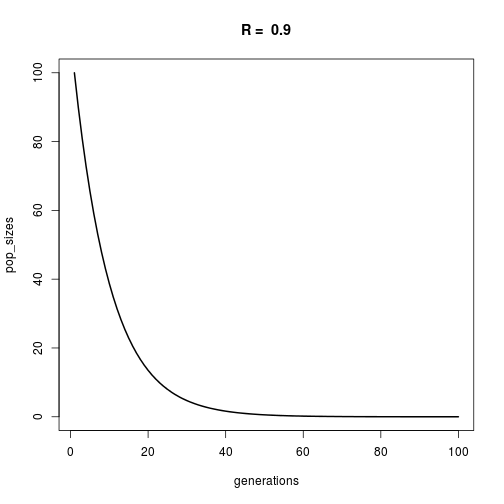
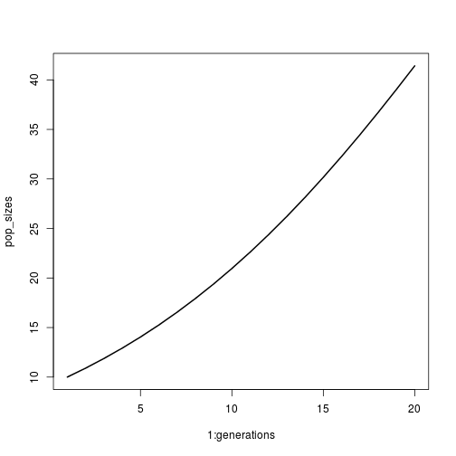
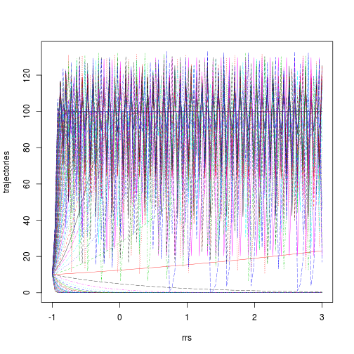

### Mini exercise 3.2.1

Tweaking parameters of discrete growth model


```r
# conditions & parameters (these are new!)
generations <- 100
RR <- 0.9 # R is a parameter
N_init <- 100 # N is a state variable

# create and populate pop size vector
pop_sizes <- numeric(generations)
pop_sizes[1] <- N_init
for (time in 2:generations){
  pop_sizes[time] <- RR*pop_sizes[time-1]
}

head(pop_sizes)
```

```
## [1] 100.000  90.000  81.000  72.900  65.610  59.049
```

```r
# My favourite plot:
plot(x = 1:generations, y = pop_sizes, type = "l", lwd = 2,
     xlab = "generations", main = paste("R = ", RR))
```

 

### Exercise 3.2.2
Convert the model to a function


```r
# The function
geom_pop_growth <- function(N, RR, generations = 20) {
  pop_sizes <- numeric(generations)
  pop_sizes[1] <- N_init
  for (time in 2:generations){
    pop_sizes[time] <- RR*pop_sizes[time-1]
  }
  plot(y = pop_sizes, x = 1:generations, type = "l", lwd = 2)
  return(pop_sizes)
}

# Run the function 
geom_pop_growth(N = 100, RR = 1.1)
```

 

```
##  [1] 100.0000 110.0000 121.0000 133.1000 146.4100 161.0510 177.1561
##  [8] 194.8717 214.3589 235.7948 259.3742 285.3117 313.8428 345.2271
## [15] 379.7498 417.7248 459.4973 505.4470 555.9917 611.5909
```


### Exercise 3.3
Logistic growth (includes carrying capacity)


```r
# parameters
# conditions & parameters (these are new!)
generations <- 200
rr <- .1 # R is a parameter
N_init <- 100 # N is a state variable
K <- 1000 # Carrying capacity - a parameter

# create and populate pop size vector
pop_sizes <- numeric(generations)
pop_sizes[1] <- N_init
for (time in 2:generations){
  pop_sizes[time] <- pop_sizes[time-1]*(1+rr*(1-pop_sizes[time-1]/K))
}
plot(y = pop_sizes, x = 1:generations, type = "l", lwd = 2)
```

 

### 3.3.1
Convert above logistic growth to a function


```r
# The function

logistic_pop_growth <- function(N, rr, generations = 20, K, plot = T) {
  pop_sizes <- numeric(generations)
  pop_sizes[1] <- N
  for (time in 2:generations){
    pop_sizes[time] <- pop_sizes[time-1]*(1+rr*(1-pop_sizes[time-1]/K))
  }
  
  if(plot == T) {plot(y = pop_sizes, x = 1:generations, type = "l", lwd = 2)}
  return(pop_sizes)
}

# Run the function
logistic_pop_growth(N = 10, rr = 0.1, K = 100)
```

 

```
##  [1] 10.00000 10.90000 11.87119 12.91738 14.04226 15.24930 16.54169
##  [8] 17.92224 19.39325 20.95648 22.61295 24.36290 26.20564 28.13947
## [15] 30.16159 32.26803 34.45360 36.71191 39.03534 41.41512
```

### Exercises 3.3.2

Do a systematic exploration of parameter space


```r
rrs <- c(-0.3, 0.3, 1.3, 1.9, 2.2, 2.7)

par(mfrow = c(2,3))
for(rr in rrs) {
  logistic_pop_growth(N = 10, rr = rr, generations = 20, K = 100)
}
```

 


### Exercise 3.3.3

Bifurcation plot


```r
rrs <- seq(from = -1, to = 3, length.out = 100)
generations <- 100
trajectories <- sapply(rrs, function(x) logistic_pop_growth(N = 10, K = 100, rr = x, generations = generations, plot = F))

# I think this is what a bifurcation plot is!
par(mfrow = c(1,1))
matplot(y = trajectories[generations, ], x = rrs, type = "l", lwd = 2, main = "Bifurcation plot?")
```

 

```r
# Or maybe it's this, but so messy!
matplot(y = trajectories, x = rrs, type = "l", lwd = 0.5)
```

 

### 4.1: Differential equations with `deSolve`

The `lsoda` function in `deSolve` is a good numerical differential equation solver. 

```r
library(deSolve)

# Set up the model
expGrowthODE <- function(tt, NN, params) { # Note that this needs to be (time, init, params!)
  derivs <- params["rr"]*NN # Exponential growth equation
  return(list(derivs))  # Return the derivs 
}

# Use lsoda to run the ODE
# lsoda(initial value of state variable, time seq, user-defined model, parameters)

# Set initial and parameters
init <- 1
tseq <- seq(from = 1, to = 20, by = 0.01)
parameters <- c(rr = 0.1)

pop_growth <- lsoda(init, tseq, expGrowthODE, parameters)
head(pop_growth)
```

```
##      time        1
## [1,] 1.00 1.000000
## [2,] 1.01 1.001001
## [3,] 1.02 1.002002
## [4,] 1.03 1.003005
## [5,] 1.04 1.004008
## [6,] 1.05 1.005013
```

```r
plot(x = pop_growth[, 1], y = pop_growth[, 2], type = "l", lwd = 2,
     xlab = "time", ylab = "population size")
```

 

### Exercise 4.2.1
Building the logistic growth model

```r
# Set up the model
logGrowthODE <- function(tt, NN, params) { 
  derivs <- params["rr"]*NN*(1-(NN/params["kk"]))
  return(list(derivs))  # Return the derivs 
}

# Set initial and parameters
init <- 10
tseq <- seq(from = 1, to = 125, by = 0.01)
parameters <- c(rr = 0.05, kk = 100)

log_pop_growth <- lsoda(init, tseq, logGrowthODE, parameters)
head(log_pop_growth)
```

```
##      time        1
## [1,] 1.00 10.00000
## [2,] 1.01 10.00450
## [3,] 1.02 10.00900
## [4,] 1.03 10.01351
## [5,] 1.04 10.01801
## [6,] 1.05 10.02252
```

```r
plot(x = log_pop_growth[, 1], y = log_pop_growth[, 2], type = "l", lwd = 2,
     xlab = "time", ylab = "population size")
```

 

```r
# plot dN/dT vs time
log_pop_growth <- data.frame(log_pop_growth)
log_pop_growth[,3] <- rep(NA, nrow(log_pop_growth))
# log_pop_growth[1, 3] <- 0
# Get dN per dt
differences <- diff(log_pop_growth[,2])
log_pop_growth[2:nrow(log_pop_growth), 3] <- differences
plot(x = log_pop_growth[, 1], y = log_pop_growth[, 3], type = "l", lwd = 2,
     xlab = "time", ylab = "change in population size")
```

 

```r
# Fix names of log_pop_growth to be a bit more readable
colnames(log_pop_growth)
```

```
## [1] "time" "X1"   "V3"
```

```r
colnames(log_pop_growth) <- c("time", "pop_size", "growth"); colnames(log_pop_growth)
```

```
## [1] "time"     "pop_size" "growth"
```

```r
# make a stacked plot
par(mfrow = c(2, 1))
plot(x = log_pop_growth[, 1], y = log_pop_growth[, 2], type = "l", lwd = 2,
     xlab = "time", ylab = "population size")
plot(x = log_pop_growth[, 1], y = log_pop_growth[, 3], type = "l", lwd = 2,
     xlab = "time", ylab = "change in population size")
```

 

```r
# Find out where growth rate (dN/dT) peaks
max_growth <- log_pop_growth[which(log_pop_growth[,3] == max(log_pop_growth[,3], na.rm = T)), ]
max_growth
```

```
##       time pop_size growth
## 4396 44.95 50.00689 0.0125
```

```r
# Make a single plot, maybe :o
par(mfrow = c(1,1), mar = c(5,4,4,4)+0.3)
plot(x = log_pop_growth[, 1], y = log_pop_growth[, 2], type = "l", lwd = 3,
     xlab = "time", ylab = "population size", main = "Population with logistic growth")
par(new = T)
plot(x = log_pop_growth[, 1], y = log_pop_growth[, 3], type = "l", lwd = 3, xlab = "", ylab = "", axes = F, col = "darkgreen")
axis(side = 4, at = pretty(range(log_pop_growth[, 3], na.rm = T)))
mtext(side = 4, "growth rate", line = 3)
text(15, .012, "growth rate", col = "darkgreen")
text(80, .012, "population size")
abline(v = max_growth[, 1], lwd = 2, lty = 2)
mtext(side = 1, text = paste("Max growth rate occurs when N = ", floor(max_growth[,2]), sep = ""), line = 4)
```

 

Playing around a bit more with the logistic growth model:


```r
# Set initial and parameters
init <- 10
tseq <- seq(from = 1, to = 125, by = 0.01)

# In exercise 3.3.2, we explored values of rr. 
# Let's do that again, but with the continuous version
# Recall that earlier, rrs <- c(-0.3, 0.3, 1.3, 1.9, 2.2, 2.7)
# We can do this in a loop.

rrs <- c(-0.3, 0.3, 1.3, 1.9, 2.2, 2.7) 
par(mfrow = c(2,3))
for (ii in rrs) {
  parameters <- c(rr = ii, kk = 100)
  log_pop_growth2 <- lsoda(init, tseq, logGrowthODE, parameters)
  head(log_pop_growth2)
  plot(y = log_pop_growth2[,2], x = log_pop_growth2[,1], type = "l", lwd = 3, xlab = "time", ylab = "population size", main = paste("r = ", ii))
  }
```

 

Compare this to the figure in Exercise 3.3.2, where the population sizes bounced around at higher values of R. This may because converting it to continuous time may make the model respond immediately to being close to the carrying capacity as opposed to responding to some previous time step. **look this up!**
