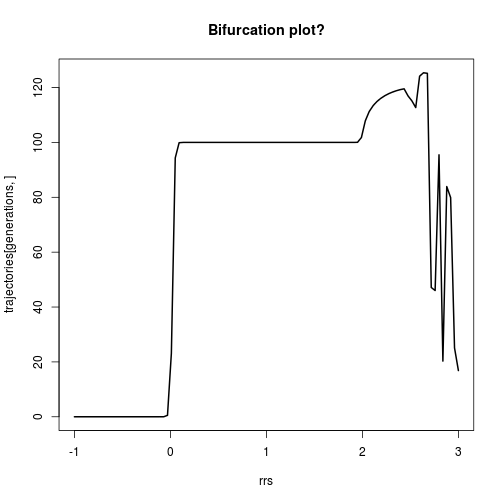

### Mini exercise 3.2.1

Tweaking parameters of discrete growth model


```r
# conditions & parameters (these are new!)
generations <- 100
RR <- 0.9 # R is a parameter
N_init <- 100 # N is a state variable

# create and populate pop size vector
pop_sizes <- numeric(generations)
pop_sizes[1] <- N_init
for (time in 2:generations){
  pop_sizes[time] <- RR*pop_sizes[time-1]
}

head(pop_sizes)
```

```
## [1] 100.000  90.000  81.000  72.900  65.610  59.049
```

```r
# My favourite plot:
plot(x = 1:generations, y = pop_sizes, type = "l", lwd = 2,
     xlab = "generations", main = paste("R = ", RR))
```

 

### Exercise 3.2.2
Convert the model to a function


```r
# The function
geom_pop_growth <- function(N, RR, generations = 20) {
  pop_sizes <- numeric(generations)
  pop_sizes[1] <- N_init
  for (time in 2:generations){
    pop_sizes[time] <- RR*pop_sizes[time-1]
  }
  plot(y = pop_sizes, x = 1:generations, type = "l", lwd = 2)
  return(pop_sizes)
}

# Run the function 
geom_pop_growth(N = 100, RR = 1.1)
```

 

```
##  [1] 100.0000 110.0000 121.0000 133.1000 146.4100 161.0510 177.1561
##  [8] 194.8717 214.3589 235.7948 259.3742 285.3117 313.8428 345.2271
## [15] 379.7498 417.7248 459.4973 505.4470 555.9917 611.5909
```


### Exercise 3.3
Logistic growth (includes carrying capacity)


```r
# parameters
# conditions & parameters (these are new!)
generations <- 200
rr <- .1 # R is a parameter
N_init <- 100 # N is a state variable
K <- 1000 # Carrying capacity - a parameter

# create and populate pop size vector
pop_sizes <- numeric(generations)
pop_sizes[1] <- N_init
for (time in 2:generations){
  pop_sizes[time] <- pop_sizes[time-1]*(1+rr*(1-pop_sizes[time-1]/K))
}
plot(y = pop_sizes, x = 1:generations, type = "l", lwd = 2)
```

 

### 3.3.1
Convert above logistic growth to a function


```r
# The function

logistic_pop_growth <- function(N, rr, generations = 20, K, plot = T) {
  pop_sizes <- numeric(generations)
  pop_sizes[1] <- N
  for (time in 2:generations){
    pop_sizes[time] <- pop_sizes[time-1]*(1+rr*(1-pop_sizes[time-1]/K))
  }
  
  if(plot == T) {plot(y = pop_sizes, x = 1:generations, type = "l", lwd = 2)}
  return(pop_sizes)
}

# Run the function
logistic_pop_growth(N = 10, rr = 0.1, K = 100)
```

 

```
##  [1] 10.00000 10.90000 11.87119 12.91738 14.04226 15.24930 16.54169
##  [8] 17.92224 19.39325 20.95648 22.61295 24.36290 26.20564 28.13947
## [15] 30.16159 32.26803 34.45360 36.71191 39.03534 41.41512
```

### Exercises 3.3.2

Do a systematic exploration of parameter space


```r
rrs <- c(-0.3, 0.3, 1.3, 1.9, 2.2, 2.7)

par(mfrow = c(2,3))
for(rr in rrs) {
  logistic_pop_growth(N = 10, rr = rr, generations = 20, K = 100)
}
```

 


### Exercise 3.3.3

Bifurcation plot


```r
rrs <- seq(from = -1, to = 3, length.out = 100)
generations <- 100
trajectories <- sapply(rrs, function(x) logistic_pop_growth(N = 10, K = 100, rr = x, generations = generations, plot = F))

# I think this is what a bifurcation plot is!
par(mfrow = c(1,1))
matplot(y = trajectories[generations, ], x = rrs, type = "l", lwd = 2,
        main = "Bifurcation plot?")
```

 

```r
# Or maybe it's this, but so messy!
matplot(y = trajectories, x = rrs, type = "l", lwd = 0.5)
```

 
