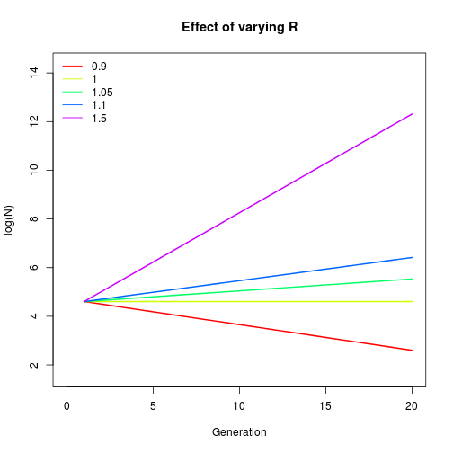
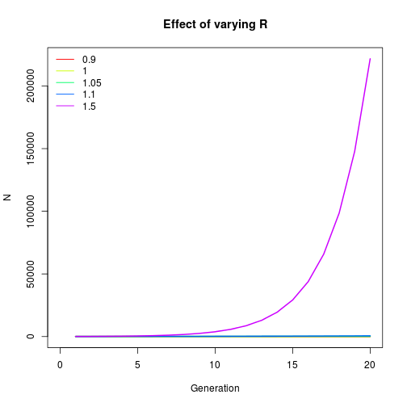

### Pseudocode
A program that calculates the sum of all numbers from 1 to 20


```r
# Set couner to 1; set Sum to counter;
# Start a loop from 1 to 20;
# Increase counter by 1; 
# Increase Sum by counter;
# Return sum

total <- 0

for (ii in 1:20){
  total <- total + ii
}

total
```

```
## [1] 210
```

```r
# Or just do this
sum(1:20)
```

```
## [1] 210
```


Pseudocode example 2: geometric population growth

```r
# Make a vector of length equal to number of generations
# The first entry is the inital population size
# In a loop from 2 to number of generations, update the vector with (time-1)*R

# conditions & parameters
generations <- 20
RR <- 1.05 # R is a parameter
N_init <- 100 # N is a state variable

# create and populate pop size vector
pop_sizes <- numeric(generations)
pop_sizes[1] <- N_init
for (time in 2:generations){
  pop_sizes[time] <- RR*pop_sizes[time-1]
}

pop_sizes
```

```
##  [1] 100.0000 105.0000 110.2500 115.7625 121.5506 127.6282 134.0096
##  [8] 140.7100 147.7455 155.1328 162.8895 171.0339 179.5856 188.5649
## [15] 197.9932 207.8928 218.2875 229.2018 240.6619 252.6950
```

```r
# Alternatively,
for (time in 2:generations){
  pop_sizes[time] <- N_init*RR^(time-1)
}
pop_sizes
```

```
##  [1] 100.0000 105.0000 110.2500 115.7625 121.5506 127.6282 134.0096
##  [8] 140.7100 147.7455 155.1328 162.8895 171.0339 179.5856 188.5649
## [15] 197.9932 207.8928 218.2875 229.2018 240.6619 252.6950
```

```r
# Pseudocode for plot:
# Make a plot with X axis of 1 to number of generations
# Y axis is population size
# Plot
plot(x = 1:generations, y = pop_sizes, type = "l")
```

 

```r
#####################################
# Make this for multiple values of R

# Define a function first
pop_growth <- function(N, RR, generations = 20) {
  pop_sizes <- numeric(generations)
  pop_sizes[1] <- N_init
  for (time in 2:generations){
    pop_sizes[time] <- RR*pop_sizes[time-1]
  }
  return(pop_sizes)
}

RRs <- c(0.9, 1, 1.05, 1.1, 1.5)
trajectories <- sapply(RRs, function(x) pop_growth(N = N_init, RR = x))


# Make a function to plot this thing
multi_plot <- function(m, log = T) {
  if(log == T) {m <- log(m)}
  range <- range(m)
  colors <- rainbow(n = ncol(m))
  
  ylab_text <- "log(N)"
  if (log == F) {ylab_text <- "N"}
  plot(1, type = "n", xlim = c(0, nrow(trajectories)), ylim = c(range[1]-1, range[2]+2), 
       main = "Effect of varying R", ylab = ylab_text, xlab = "Generation")
  
  sapply(1:ncol(m), function(x) lines(y = m[,x], x = 1:nrow(m), col = colors[x], lwd = 2))
  legend("topleft", col = colors, legend = RRs, lwd = 1.25, bty = "n")
}

multi_plot(m = trajectories); multi_plot(m = trajectories, log = F)
```

  

```r
# Try this in ggplot2 at some point
```

