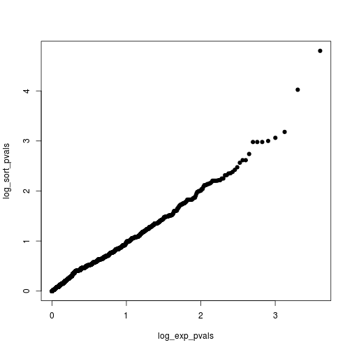

Plotting and genetic variation analysis exercises.
Last generated on Thu Sep 17 15:17:51 2015. 

```r
snp_data <- read.table("../hapmap_CEU_r23a_chr2_ld-1.txt")
snp_data <- as.matrix(snp_data)

# function for chisq 
compute_chisquare=function(x){
	freq=sum(x,na.rm=TRUE)/(2.0*sum(!is.na(x)))
	cnt0=sum(x==0,na.rm=TRUE)
	cnt1=sum(x==1,na.rm=TRUE)
	cnt2=sum(x==2,na.rm=TRUE)
	obscnts=c(cnt0,cnt1,cnt2)
	#print(obscnts)
	n=sum(obscnts)
	expcnts=c((1-freq)^2,2*freq*(1-freq),freq^2)*n
	chisq=sum((obscnts-expcnts)^2/expcnts)
	return(chisq)
}


# Part A
chisqs <- apply(snp_data,1,compute_chisquare); head(chisqs)
```

```
##   rs300761_G  rs4854302_C  rs6717613_A  rs4643574_A  rs2709557_A 
##   0.74074074   0.35164030   0.63031261   0.32921811   0.30612245 
## rs11686764_G 
##   0.01002484
```

```r
pvals <- pchisq(chisqs,1,lower.tail=FALSE); head(pvals)
```

```
##   rs300761_G  rs4854302_C  rs6717613_A  rs4643574_A  rs2709557_A 
##    0.3894237    0.5531861    0.4272407    0.5661199    0.5800694 
## rs11686764_G 
##    0.9202458
```

```r
# Part B
for (ii in c(0.001, 0.01, 0.05, 0.25)) {
  print(mean(pvals < ii))
}
```

```
## [1] 0.00124564
## [1] 0.01021425
## [1] 0.04509218
## [1] 0.245142
```

```r
# Part C
num_pvals <- length(pvals); num_pvals
```

```
## [1] 4014
```

```r
# Part D
expected_pvals <- (1:num_pvals)/num_pvals; head(expected_pvals)
```

```
## [1] 0.0002491281 0.0004982561 0.0007473842 0.0009965122 0.0012456403
## [6] 0.0014947683
```

```r
# Part E
pvals <- sort(pvals); head(pvals)
```

```
## rs13432713_T rs10179852_A rs12712519_G  rs1108190_G  rs1862098_T 
## 1.582130e-05 9.466129e-05 6.597265e-04 8.659390e-04 9.991493e-04 
##  rs1364646_A 
## 1.048645e-03
```

```r
# Part F
log_sort_pvals <- -(log10(pvals))
log_exp_pvals <- -(log10(expected_pvals))

# Part G
plot(y = log_sort_pvals, x = log_exp_pvals, pch = 19)
```

 

```r
# Part H
plot(y = log_sort_pvals, x = log_exp_pvals, pch = 19, 
     ylab = expression(paste(log[10], "(observed P)")),
     xlab = expression(paste(log[10], "(expected P)")),
     main = "QQ plot for chisq test")
abline(a = 0, b = 1, lty = 2, col = "red", lwd = 4)
```

 


### Problem 2


```r
# Part A
zz <- read.table("../pheno.sim.2014-1.txt", header = T) 
head(zz)
```

```
##   Indiv glucose_mmolperL
## 1     1         4.930034
## 2     2         7.741942
## 3     3         4.917432
## 4     4         6.344764
## 5     5         4.437609
## 6     6         5.352734
```

```r
# Take a look at blood glucose distributions
plot(density(zz[,2]), lwd = 2)
```

 

```r
# Part B
low_cutoff <- quantile(zz[, 2], 0.25); low_cutoff
```

```
##      25% 
## 4.768756
```

```r
controls <- which(zz[, 2] < low_cutoff); controls
```

```
##  [1]  5 10 11 12 14 15 16 23 26 29 38 42 45 46 57
```

```r
length(controls) == 0.25*nrow(zz) # Verify
```

```
## [1] TRUE
```

```r
# Part C
high_cutoff <- quantile(zz[, 2], 0.75); high_cutoff
```

```
##      75% 
## 7.354975
```

```r
cases <- which(zz[, 2] > high_cutoff); cases
```

```
##  [1]  2  7  8  9 22 27 28 34 44 48 49 50 53 54 60
```

```r
length(cases) == 0.25*nrow(zz) # Verify
```

```
## [1] TRUE
```

```r
# Part D
plot(density(zz[,2]), lwd = 3, main = "Distribution of blood glucose")
abline(v = c(low_cutoff, high_cutoff), lwd = 2, lty = 2)
```

 

```r
# Parts E and F
case_genotypes <- snp_data["rs7584086_T", cases]; length(case_genotypes)
```

```
## [1] 15
```

```r
control_genotypes <- snp_data["rs7584086_T", controls]; length(control_genotypes)
```

```
## [1] 15
```

```r
# Parts G and H
table(case_genotypes) 
```

```
## case_genotypes
##  1  2 
## 12  3
```

```r
table(control_genotypes) # One of them is NA - should be total of 15...
```

```
## control_genotypes
##  0 
## 14
```

The intuition here might be that all of the "control" individuals are homozygous for the dominant allele; all of the "case" individuals have at least one copy of the rare allele. 
