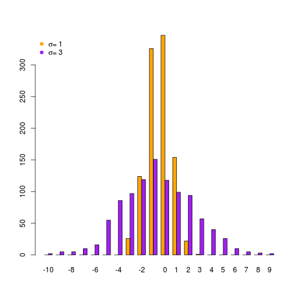

```r
set.seed(12390)
s1 <- rnorm(n = 1000, sd = 1, mean = 0)
s3 <- rnorm(n = 1000, sd = 3, mean = 0)

head(s1); head(s3)
```

```
## [1]  0.42389200  1.41130036 -0.48108223 -0.95697924  0.03461718  1.11899678
```

```
## [1]  4.4858337 -5.0042550 -3.5718877  0.7493445  1.5724500  5.7992032
```

```r
bins <- seq(from = -10, to = 10, by = 1)
bins
```

```
##  [1] -10  -9  -8  -7  -6  -5  -4  -3  -2  -1   0   1   2   3   4   5   6
## [18]   7   8   9  10
```

```r
counts_s1 <- hist(s1, breaks = bins)$counts
```

 

```r
counts_s3 <- hist(s3, breaks = bins)$counts
```

 

```r
counts_s1; counts_s3
```

```
##  [1]   0   0   0   0   0   0   0  26 124 326 347 154  22   1   0   0   0
## [18]   0   0   0
```

```
##  [1]   2   5   5  10  16  55  86  97 119 151 118  99  94  57  40  26  10
## [18]   5   3   2
```

```r
cols <- c("orange", "purple")

barplot(rbind(counts_s1, counts_s3), beside = T, col = cols, names.arg = seq(from = -10, to = 9.5, by = 1), width = 2)
legend("topleft", col = cols, pch = 19, 
       legend = c(expression(paste(sigma, "= 1")), expression(paste(sigma, "= 3"))), bty = "n")
```

 
