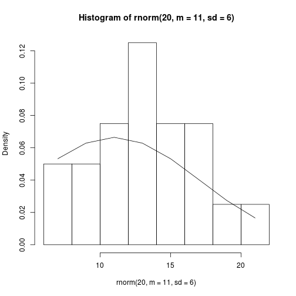

### Appendix B1
This section focuses on using R's help functions.

```r
### When you know a function name ----
?mean

# Equivalent:
help(mean)
?mean

### When you don't know a function name ----
help.search("mean") # Here, "mean" is just a keyword
apropos("mean") # Here, functions with "mean" in the name are shown
```

```
##  [1] "colMeans"      ".colMeans"     "kmeans"        "mean"         
##  [5] "mean.Date"     "mean.default"  "mean.difftime" "mean.POSIXct" 
##  [9] "mean.POSIXlt"  "rowMeans"      ".rowMeans"     "weighted.mean"
```

```r
### When you want to search in packages that might not yet be on the system
# RSiteSearch("violin") # This opens in the browser -- commented for now...
```

### Appendix B2

This section works through assigning values to variables.

```r
a <- 2+3
a
```

```
## [1] 5
```

```r
# Use a as input to another variable
b <- a+a

# Use semicolon to make two calls on one line
a+b; b+b
```

```
## [1] 15
```

```
## [1] 20
```

### Appendix B3

#### Appendix B3.1
Vectors 


```r
# Creating a vector Y with some known values
Y <- c(8.3, 8.6, 10.7, 10.8, 11, 11, 11.1, 11.2,11.3, 11.4)

# Creating sequences of numbers
1:4
```

```
## [1] 1 2 3 4
```

```r
4:1
```

```
## [1] 4 3 2 1
```

```r
-1:3
```

```
## [1] -1  0  1  2  3
```

```r
-(1:3) # minus sign outside acts as a function
```

```
## [1] -1 -2 -3
```

```r
# Sequencing by non-integer increments
seq(from = 1, to = 3, by = 0.2)
```

```
##  [1] 1.0 1.2 1.4 1.6 1.8 2.0 2.2 2.4 2.6 2.8 3.0
```

```r
seq(1, 3, by = 0.2) # We can skip argument names
```

```
##  [1] 1.0 1.2 1.4 1.6 1.8 2.0 2.2 2.4 2.6 2.8 3.0
```

```r
seq(1, 3, length = 7) # If we just know how long a vector we need
```

```
## [1] 1.000000 1.333333 1.666667 2.000000 2.333333 2.666667 3.000000
```

```r
# Repeating sequences
rep(1, 3) # Repeat 1 three times
```

```
## [1] 1 1 1
```

```r
rep(1:3, 2) # Repeat 1:3 three times
```

```
## [1] 1 2 3 1 2 3
```

```r
rep(1:3, each = 2) # Repeat each number in 1:3 twice
```

```
## [1] 1 1 2 2 3 3
```


#### Appendix B3.2
Info about vectors

```r
# Recall Y:
Y
```

```
##  [1]  8.3  8.6 10.7 10.8 11.0 11.0 11.1 11.2 11.3 11.4
```

```r
sum(Y)
```

```
## [1] 105.4
```

```r
mean(Y)
```

```
## [1] 10.54
```

```r
max(Y)
```

```
## [1] 11.4
```

```r
length(Y)
```

```
## [1] 10
```

```r
summary(Y)
```

```
##    Min. 1st Qu.  Median    Mean 3rd Qu.    Max. 
##    8.30   10.72   11.00   10.54   11.18   11.40
```

Vectors aren't always numeric

```r
Names <- c("Sarah", "Yunluan")
Names
```

```
## [1] "Sarah"   "Yunluan"
```

```r
b <- c(TRUE, FALSE)

# Find out what kind of a vector it is!
class(Y); class(b)
```

```
## [1] "numeric"
```

```
## [1] "logical"
```

Tests are vectorized:

```r
Y>10
```

```
##  [1] FALSE FALSE  TRUE  TRUE  TRUE  TRUE  TRUE  TRUE  TRUE  TRUE
```

```r
Y > mean(Y)
```

```
##  [1] FALSE FALSE  TRUE  TRUE  TRUE  TRUE  TRUE  TRUE  TRUE  TRUE
```

```r
Y == 11
```

```
##  [1] FALSE FALSE FALSE FALSE  TRUE  TRUE FALSE FALSE FALSE FALSE
```

```r
Y != 11
```

```
##  [1]  TRUE  TRUE  TRUE  TRUE FALSE FALSE  TRUE  TRUE  TRUE  TRUE
```

```r
# We can use this to extract the data:
# Get all values of Y that are bigger than the mean of Y:
Y[Y > mean(Y)]
```

```
## [1] 10.7 10.8 11.0 11.0 11.1 11.2 11.3 11.4
```

Vector algebra

```r
a <- 1:3
b <- 4:6

# Play with two vectors of equal lengths
a + b
```

```
## [1] 5 7 9
```

```r
a * b
```

```
## [1]  4 10 18
```

```r
a/b
```

```
## [1] 0.25 0.40 0.50
```

```r
# Play with a vector and a scalar
a + 1
```

```
## [1] 2 3 4
```

```r
a * 2
```

```
## [1] 2 4 6
```

```r
1/a
```

```
## [1] 1.0000000 0.5000000 0.3333333
```

```r
# Play with two vectors of unequal lengths
a * 1:2 # Note the warning.... This is equivalent to `a * c(1, 2, 1)`
```

```
## Warning in a * 1:2: longer object length is not a multiple of shorter
## object length
```

```
## [1] 1 4 3
```

```r
1:4 * 1:2 # Note no warning here, even though it's 4 * 2.
```

```
## [1] 1 4 3 8
```

#### Appendix B3.3
Extracting data and handling missing values
Two ways to extract data from vectors: 1) provide numeric index; 2) provide logical vector


```r
# Using numeric index
Y[1]
```

```
## [1] 8.3
```

```r
Y[1:3]
```

```
## [1]  8.3  8.6 10.7
```

```r
# Using logical vector
Y[Y > mean(Y)] # Recall that the inside is just a T/F vector
```

```
## [1] 10.7 10.8 11.0 11.0 11.1 11.2 11.3 11.4
```

Missing data is SRS BSNS!

```r
a <- c(5, 3, 6, NA)
a
```

```
## [1]  5  3  6 NA
```

```r
is.na(a)
```

```
## [1] FALSE FALSE FALSE  TRUE
```

```r
sum(a) # Throws an error since R doesn't know how to add NA
```

```
## [1] NA
```

```r
# Multiple ways to eliminate the NAs from vectors (if that's the goal)
a[!is.na(a)]
```

```
## [1] 5 3 6
```

```r
na.exclude(a)
```

```
## [1] 5 3 6
## attr(,"na.action")
## [1] 4
## attr(,"class")
## [1] "exclude"
```

```r
# Some functions can remove NAs on the fly...
mean(a) # Fail
```

```
## [1] NA
```

```r
mean(a, na.rm = T) # Success
```

```
## [1] 4.666667
```

#### Appendix B.3.4
Matrices! Two dimensions, all data are of the same type


```r
matrix(letters[1:4], ncol = 2)
```

```
##      [,1] [,2]
## [1,] "a"  "c" 
## [2,] "b"  "d"
```

```r
M <- matrix(1:4, nrow = 2); M # Notice that the numbers are filled in by column
```

```
##      [,1] [,2]
## [1,]    1    3
## [2,]    2    4
```

```r
matrix(1:4, nrow = T, byrow = T) # To fill in by row
```

```
##      [,1] [,2] [,3] [,4]
## [1,]    1    2    3    4
```

```r
# Making an identity matrix
I <- diag(1, nrow = 2)

# We can make inverse matrices of known matrices easily:

M_inv <- solve(M)
M %*% M_inv 
```

```
##      [,1] [,2]
## [1,]    1    0
## [2,]    0    1
```

Extracting data from matrices is the same... matrix[row, column]

```r
M [1, 2] # First row; second col
```

```
## [1] 3
```

```r
M [1, ]; M[1, 1:2] # Both are equivalent
```

```
## [1] 1 3
```

```
## [1] 1 3
```


*Skipping "Simple Matrix Algebra" for now.*

------------------------------------
**The rest of this is not part of the assignment, just did it to work through the latter sections like ODEs and Optimizations**

#### Appendix B3.5
Data frames: two dimensionsal, like matrices, but can store multiple types of data, unlike matrices...


```r
dat <- data.frame(species = c("S.altissima", "S.rugosa", "E.graminifolia", "A. pilosus"), 
                  treatment = factor(c("Control","Water", "Control", "Water")),
                  height = c(1.1,0.8, 0.9, 1), 
                  width = c(1, 1.7, 0.6, 0.2))
dat
```

```
##          species treatment height width
## 1    S.altissima   Control    1.1   1.0
## 2       S.rugosa     Water    0.8   1.7
## 3 E.graminifolia   Control    0.9   0.6
## 4     A. pilosus     Water    1.0   0.2
```

```r
# Extracting data 
dat[2, ]
```

```
##    species treatment height width
## 2 S.rugosa     Water    0.8   1.7
```

```r
dat[, 2]
```

```
## [1] Control Water   Control Water  
## Levels: Control Water
```

```r
dat[3, 4]
```

```
## [1] 0.6
```

```r
# We can treat these as vectors...
dat[, 2] == "Water"
```

```
## [1] FALSE  TRUE FALSE  TRUE
```

```r
# Use this to subset dat to only water
dat[dat[,2] == "Water", ] # Or just use the subset()
```

```
##      species treatment height width
## 2   S.rugosa     Water    0.8   1.7
## 4 A. pilosus     Water    1.0   0.2
```

```r
# Data frames often have factors.
c("Control", "Medium", "High")
```

```
## [1] "Control" "Medium"  "High"
```

```r
rep(c("Control", "Medium", "High"), each = 3)
```

```
## [1] "Control" "Control" "Control" "Medium"  "Medium"  "Medium"  "High"   
## [8] "High"    "High"
```

```r
Treatment <- factor(rep(c("Control", "Medium", "High"), each = 3))
Treatment
```

```
## [1] Control Control Control Medium  Medium  Medium  High    High    High   
## Levels: Control High Medium
```

```r
# The levels are stored alphabetically (i.e 1 will be control):
levels(Treatment)
```

```
## [1] "Control" "High"    "Medium"
```

```r
stripchart(1:9 ~ Treatment)
```

 

```r
# We can force levels to be different:
Treatment <- factor(rep(c("Control", "Medium", "High"), each = 3), 
                    levels = c("Control", "Medium", "High"))
stripchart(1:9 ~ Treatment)
```

 

#### Appendix B3.6
Lists are just globs of objects...


```r
my.list <- list(My.Y = Y, b = b, 
                Names, 
                Weed.data = dat,
                My.matrix = M, 
                my.no = 4)
my.list
```

```
## $My.Y
##  [1]  8.3  8.6 10.7 10.8 11.0 11.0 11.1 11.2 11.3 11.4
## 
## $b
## [1] 4 5 6
## 
## [[3]]
## [1] "Sarah"   "Yunluan"
## 
## $Weed.data
##          species treatment height width
## 1    S.altissima   Control    1.1   1.0
## 2       S.rugosa     Water    0.8   1.7
## 3 E.graminifolia   Control    0.9   0.6
## 4     A. pilosus     Water    1.0   0.2
## 
## $My.matrix
##      [,1] [,2]
## [1,]    1    3
## [2,]    2    4
## 
## $my.no
## [1] 4
```

```r
# Multiple ways of getting objects out of lists:
my.list[["b"]]; my.list[[2]]; my.list$b
```

```
## [1] 4 5 6
```

```
## [1] 4 5 6
```

```
## [1] 4 5 6
```

```r
# We can extract specific components from the objects
my.list[["b"]][1]
```

```
## [1] 4
```

```r
# We can think of data frames as a list of vectors;
# This is what allows us to use the $ operator to extract data from dfs!
```


### Appendix B5
Sorting

```r
e <- c(5,4,2,3,1)
sort(e); sort(e, decreasing = T)
```

```
## [1] 1 2 3 4 5
```

```
## [1] 5 4 3 2 1
```

```r
# If we want to sort all the rows of a data frame, keeping records (rows) intact, we can use order. This function is a little tricky, so we explore its use in a vector.
e; order(e); e[order(e)] # Order is generating the index to give us the sorted vector
```

```
## [1] 5 4 2 3 1
```

```
## [1] 5 3 4 2 1
```

```
## [1] 1 2 3 4 5
```

```r
# This becomes a little clearer with a df 

dat
```

```
##          species treatment height width
## 1    S.altissima   Control    1.1   1.0
## 2       S.rugosa     Water    0.8   1.7
## 3 E.graminifolia   Control    0.9   0.6
## 4     A. pilosus     Water    1.0   0.2
```

```r
order(dat$height)
```

```
## [1] 2 3 4 1
```

```r
dat[order(dat$height), ] # The width is in order!
```

```
##          species treatment height width
## 2       S.rugosa     Water    0.8   1.7
## 3 E.graminifolia   Control    0.9   0.6
## 4     A. pilosus     Water    1.0   0.2
## 1    S.altissima   Control    1.1   1.0
```

```r
dat[rev(order(dat$height)), ] # The width is reversed!
```

```
##          species treatment height width
## 1    S.altissima   Control    1.1   1.0
## 4     A. pilosus     Water    1.0   0.2
## 3 E.graminifolia   Control    0.9   0.6
## 2       S.rugosa     Water    0.8   1.7
```

### Appendix B6
Skipping for now. 

### Appendix B7
#### Appendix B7.1
Read through [Hadley's Tidy Data paper](http://www.jstatsoft.org/v59/i10/paper)

```r
summary(CO2)
```

```
##      Plant             Type         Treatment       conc     
##  Qn1    : 7   Quebec     :42   nonchilled:42   Min.   :  95  
##  Qn2    : 7   Mississippi:42   chilled   :42   1st Qu.: 175  
##  Qn3    : 7                                    Median : 350  
##  Qc1    : 7                                    Mean   : 435  
##  Qc3    : 7                                    3rd Qu.: 675  
##  Qc2    : 7                                    Max.   :1000  
##  (Other):42                                                  
##      uptake     
##  Min.   : 7.70  
##  1st Qu.:17.90  
##  Median :28.30  
##  Mean   :27.21  
##  3rd Qu.:37.12  
##  Max.   :45.50  
## 
```

```r
head(CO2)
```

```
##   Plant   Type  Treatment conc uptake
## 1   Qn1 Quebec nonchilled   95   16.0
## 2   Qn1 Quebec nonchilled  175   30.4
## 3   Qn1 Quebec nonchilled  250   34.8
## 4   Qn1 Quebec nonchilled  350   37.2
## 5   Qn1 Quebec nonchilled  500   35.3
## 6   Qn1 Quebec nonchilled  675   39.2
```

We want to convert these such that the `conc` factor is just split into new columns


```r
CO2.wide <- reshape(CO2, v.names = "uptake", idvar = "Plant", timevar = "conc", direction = "wide")
names(CO2.wide)
```

```
##  [1] "Plant"       "Type"        "Treatment"   "uptake.95"   "uptake.175" 
##  [6] "uptake.250"  "uptake.350"  "uptake.500"  "uptake.675"  "uptake.1000"
```

```r
# To go back to long format:
CO2.long <- reshape(CO2.wide, v.names = "Uptake", 
                    varying = list(4:10), timevar = "Concentration", 
                    times = c(95, 175, 250, 350, 500, 675, 1000))
```

#### Appendix B7.2
Summarising by groups


```r
# First argument is the column to be summarised; second is column identifying group belonging; third is the function
tapply(CO2[[,"uptake"]], list(CO2[["Treatment"]]), mean)
```

```
## Error in `[[.data.frame`(CO2, , "uptake"): argument "..1" is missing, with no default
```

```r
# Summarizing by treatment AND type
tapply(CO2[["uptake"]], list(CO2[["Treatment"]], CO2[["Type"]]), sd)
```

```
##              Quebec Mississippi
## nonchilled 9.596371    7.402136
## chilled    9.644823    4.058976
```

```r
# `aggregate` allows us to summarize multiple columns at once: 
aggregate(CO2[, 4:5], list(Plant = CO2[["Plant"]]), mean)
```

```
##    Plant conc   uptake
## 1    Qn1  435 33.22857
## 2    Qn2  435 35.15714
## 3    Qn3  435 37.61429
## 4    Qc1  435 29.97143
## 5    Qc3  435 32.58571
## 6    Qc2  435 32.70000
## 7    Mn3  435 24.11429
## 8    Mn2  435 27.34286
## 9    Mn1  435 26.40000
## 10   Mc2  435 12.14286
## 11   Mc3  435 17.30000
## 12   Mc1  435 18.00000
```

*Note to self*: Redo this using `reshape2` at some point. 

### Appendix B8
Reading into and Writing out from R


```r
dat <- data.frame(Name = rep(c("Control", "Treatment"),
                             each = 5), First = runif(10), Second = rnorm(1))

# Spitting out dfs to the current wd
write.table(dat, file = "dat.txt")
write.csv(dat, file = "dat.csv")

# Reading it back in
dat.new <- read.csv("dat.csv")
dat.new2 <- read.table("dat.txt", header = TRUE)

# Spitting out some analyses:
mod.out <- summary(aov(First ~ Name, data = dat))
mod.out[[1]]
write.csv(mod.out[[1]], "ModelANOVA.csv")
```

### Apppendix B9
Probability distributions and Randomization

There are many probability functions in r: `rnorm`, `dnorm`, `pnorm`, `qnorm`,...


```r
qnorm(p = c(0.025, 0.975))
```

```
## [1] -1.959964  1.959964
```

```r
myplot <- hist(rnorm(20, m = 11, sd = 6), probability = TRUE)
myplot
```

```
## $breaks
## [1] -5  0  5 10 15 20 25
## 
## $counts
## [1] 2 0 5 5 5 3
## 
## $density
## [1] 0.02 0.00 0.05 0.05 0.05 0.03
## 
## $mids
## [1] -2.5  2.5  7.5 12.5 17.5 22.5
## 
## $xname
## [1] "rnorm(20, m = 11, sd = 6)"
## 
## $equidist
## [1] TRUE
## 
## attr(,"class")
## [1] "histogram"
```

```r
lines(myplot$mids, dnorm(myplot$mids, m = 11, sd = 6)) # This is the pdf
```

 

### Appendix B10
Numerical integration of ODEs using `desolve`


```r
library(deSolve)
logGrowth <- function(t, y, p) {
  N <- y[1]
  with(as.list(p), {
    dN.dt <- r * N * (1 - a * N) 
    return(list(dN.dt))
  })
}

p <- c(r = 1, a = 0.001) # The parameters
y0 <- c(N = 10) # Init N
t <- 1:20 # Number of time steps

out <- ode(y = y0, times = t, func = logGrowth, parms = p)
head(out)
```

```
##      time         N
## [1,]    1  10.00000
## [2,]    2  26.72369
## [3,]    3  69.45310
## [4,]    4 168.66426
## [5,]    5 355.46079
## [6,]    6 599.85982
```

Modeling two species competition

```r
LVComp <- function(t, y, p) {
  N <- y

  with(as.list(p), {
    dN1.dt <- r[1] * N[1] * (1 - a[1, 1] * N[1] - a[1, 2] * N[2])
    dN2.dt <- r[2] * N[2] * (1 - a[2, 1] * N[1] - a[2, 2] * N[2])
    
    return(list(c(dN1.dt, dN2.dt)))
  })
}

# Specify start conditions in the format required by the function

a <- matrix(c(0.02, 0.01, 0.01, 0.03), nrow = 2)
r <- c(1, 1)
p2 <- list(r, a)
N0 <- c(10, 10)

t2 <- c(1, 5, 10, 20)
out <- ode(y = N0, times = t2, func = LVComp, parms = p2)
out[1:4, ]
```

```
##      time        1        2
## [1,]    1 10.00000 10.00000
## [2,]    5 35.53914 21.79929
## [3,]   10 39.61141 20.35672
## [4,]   20 39.99332 20.00667
```
*Note to self*: Keep in mind `hmax` which can make the function take a big step
`lsodar` returns roots to ODEs if they exist:


```r
EV <- function(t, y, p) {
  
  with(as.list(p), {
    dv.dt <- b * y[1] * (1 - 0.005 * y[1]) 
    a * y[1] * y[2]
    de.dt <- a * e * y[1] * y[2] - s * y[2]
    return(list(c(dv.dt, de.dt)))
  })
}

# The rootfun checks whether the difference between the last few entries is less than some small number - here, 1e-10
rootfun <- function(t, y, p) {
  dstate <- unlist(EV(t, y, p))
  return(sum(abs(dstate)) - 1e-10)
}

# Set the function inputs
p <- c(b = 0.5, a = 0.02, e = 0.1, s = 0.2)
t <- c(0, 1e+10) # The time is set to a large number so the rootfun has all the time it needs to find an equilibrium

# Run function
out <- ode(y = c(45, 200), t, EV, parms = p, rootfun = rootfun, method = "lsodar")
out
```

```
##      time   1   2
## 1    0.00  45 200
## 2 3529.29 200 NaN
```

### Appendix B11
Numerical optimization

We need to perform numerical optimization when we think that a model might describe a system, but we don't know the parameters values for the model. 
 
From the text:  
Once you have a model of the reality you want to describe, the basic steps
toward optimization we consider are (i) create an *objective function*, (ii) use
a routine to *minimize (or maximize) the objective function through optimal
choice of parameter values*, and (iii) see if the “optimal” parameters values make
sense, and perhaps refine and interpret them.

An objective function compares the data to the predicted values from the
model, and returns a quantitative measure of their difference. (e.g. Least Squares, ML). 

In Maximum Liklihood, we use a pdf and try to tweak its parameters and calculate the probability of observing some data. "In other words, we pretend that the model and the predicted values are true, measure how far off each datum is from the predicted value, and then use a probability distribution to calculate the probability of seeing each datum." [...] "An optimization routine then tries to find model parameters that maximize this likelihood."

`R`'s functions `optimize`, `optim` and `bbmle::mle2` are the ones explored here- the first used when we are estimating just a single parameter. 


```r
# In this scenario, we have a vector y and are estimating the mean

y <- c(1, 0:10)

# Define an optimization function -- here, the square differences between datum and mean are computed
f <- function(y, mu) {
  sum((y-mu)^2)
}

# If we guess a value for mu...
guesses <- seq(from = 4, to = 6, by = 0.05)

squared_diffs <- sapply(guesses, function(i) f(y, i))

plot(squared_diffs~guesses, type = "l")
```

 

This procedure can be achieved with `optimize` in `R`.


```r
optimize(f = f, interval = c(0, 10), y = y)
```

```
## $minimum
## [1] 4.666667
## 
## $objective
## [1] 124.6667
```

Optimizing using maximum likelihood is similar, but we minimize the negative logarithm of the likelihood. Note that we use the normal pdf here because we assume that the data themselves are normally distributed


```r
LL <- function(mu, SD) {
  -sum(dnorm(y, mean = mu, sd = SD, log = T))
}

# We use the optimization routine mle2 in bbmle:

library(bbmle)
# Equivalent calls:
# fit <- mle2(y ~ dnorm(mu, sd = SD), start = list(mu = 5, SD = 1)))
fit <- mle2(LL, start = list(mu = 5, SD = 1), control = list(maxit = 10^5))
```

```
## Warning in dnorm(y, mean = mu, sd = SD, log = T): NaNs produced
```

```
## Warning in dnorm(y, mean = mu, sd = SD, log = T): NaNs produced
```

```r
summary(fit)
```

```
## Maximum likelihood estimation
## 
## Call:
## mle2(minuslogl = LL, start = list(mu = 5, SD = 1), control = list(maxit = 10^5))
## 
## Coefficients:
##    Estimate Std. Error z value     Pr(z)    
## mu  4.66672    0.93038  5.0159 5.278e-07 ***
## SD  3.22294    0.65781  4.8995 9.606e-07 ***
## ---
## Signif. codes:  0 '***' 0.001 '**' 0.01 '*' 0.05 '.' 0.1 ' ' 1
## 
## -2 log L: 62.14337
```

```r
pr <- profile(fit)
```

```
## Warning in dnorm(y, mean = mu, sd = SD, log = T): NaNs produced
```

```
## Warning in dnorm(y, mean = mu, sd = SD, log = T): NaNs produced
```

```
## Warning in dnorm(y, mean = mu, sd = SD, log = T): NaNs produced
```

```
## Warning in dnorm(y, mean = mu, sd = SD, log = T): NaNs produced
```

```r
plot(pr)
```

 

*Note to self*: work through disease modeling example in chapter 6. 

### Appendix B12
Derivatives in R


```r
host1 <- expression(R * H * (1 + a * P)^-k)
# derive with respect to H
D(host1, "H")
```

```
## R * (1 + a * P)^-k
```
